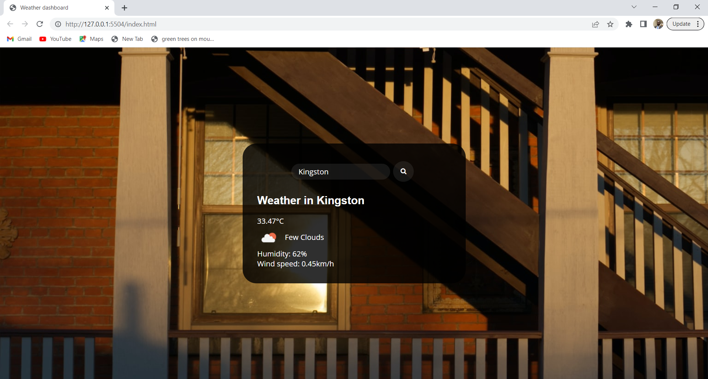
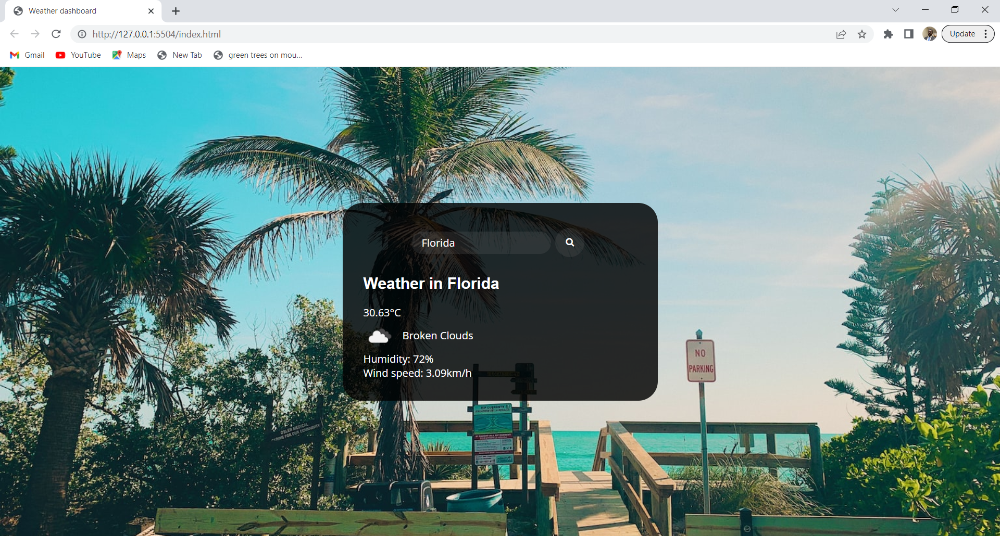
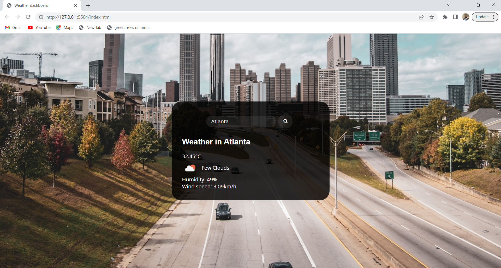

# Weather App

The weather app is a web application that provides real-time weather information for cities worldwide. It offers a user-friendly interface with a search bar to input city names. After searching, users can view the current weather, including city name, weather icon, temperature, humidity, and wind speed. A search history feature allows users to revisit previous city weather data. The app's design is responsive and adaptable to various devices. Upon visiting the app, users are greeted with a clean and visually appealing layout. The main section of the app includes a search bar where users can enter the name of a city they want to know the weather for. After typing the city name and clicking the "Search" button, the app fetches data from the OpenWeatherMap API and displays the current weather conditions for the specified location. With a beautiful photo of the said city will be displayed in the background.The weather app is a practical, informative, and well-designed application that allows users to obtain real-time weather updates for cities worldwide. With its intuitive interface, responsive design, and deployment on GitHub to showcases both technical competence and a commitment to creating useful applications for users.

## Key Summary features of this project include:

. Allows users to search for weather information by entering the city name and clicking on the "Search button"
. The app displays the current weather condiction for the city including the city name, Icon representation on of the weather condition, temperature, humidity and wind speed.
. The application displays a beautiful photo the city which changes intermittently

**Motivation**
Creating a weather app and deploying it on my GitHub page was a transformative experience in my coding journey. Here's are reasons why I embarked on this exciting project:

1. **Hands-on Learning**: Building a weather app provided me with the hands-on experience in working with real-world APIs, data manipulation, and integrating external data sources into your applications. It's an opportunity to apply the knowledge gained during my bootcamp in a practical and meaningful way.

2. **Problem-Solving Skills**: Developing a weather app will challenge your problem-solving skills as you figure out how to fetch and display weather data, design a user-friendly interface, and handle different edge cases. It's a chance to push my boundaries and grow as a developer.

3. **Relevance and Utility**: Weather apps are practical and widely used, making this project immediately relevant and useful. Knowing that my app can potentially benefit others adds a sense of purpose to your work.

4. **Portfolio Showcase**: Deploying your weather app on GitHub showcases my abilities to potential employers and peers. It becomes a tangible representation of your skills, dedication, and passion for coding. My GitHub page will act as an impressive portfolio that speaks volumes about your capabilities.

5. **Community Interaction**: Sharing your weather app on GitHub opens doors to the vast developer community. You can learn from others' feedback, collaborate on similar projects, and even contribute to open-source initiatives. Engaging with others will enrich my coding experience.

6. **Career Growth**: Employers value practical projects that demonstrate dovelopers ability to build functional applications. The weather app on my GitHub page can be a powerful talking point in interviews, setting you apart from other candidates and increasing your chances of landing your dream job.

7. **Personal Fulfillment**: Completing and deploying a weather app is a fulfilling accomplishment. It boosts my confidence, gives me a sense of achievement, and encouragement to tackle even more ambitious projects in the future.

8. **Continuous Learning**: Building the weather app, I did encounter new challenges and opportunities to learn. Embrace the process of continuous learning and exploration, as it is a fundamental aspect of a successful developer's journey.

So, go ahead and create that weather app! Dive into the code, enjoy the learning journey, and let the world see what you can build. Your GitHub page will become a testament to your growth as a developer and a gateway to exciting opportunities in the tech industry.

## Installation

To access the Work Day Scheduler application using the URL "http://127.0.0.1:5500/index.html", you can follow these steps:

1. Clone this repository to your local machine or download the source code as a ZIP file and extract it . Ensure you have the application files: Make sure you have downloaded or obtained the necessary files for the Wweather application. Typically, these files include HTML, CSS, and JavaScript files.

2. Place the files in a directory: Create a directory on your local machine where you want to store the application files.

3. Use tools like Visual Studio Code's Live Server extension, to open the index.html file and it will display the page URL

4. Access the application: Open your web browser (e.g., Chrome, Firefox, etc.) and enter the URL "http://127.0.0.1:5500/index.html" in the address bar. Press Enter to load the page.

5. The Weather application should now load in your web browser, and you can interact with it according to its intended functionality.

Congratulations! You have successfully launched the Weather Application.

## Usage.

Here's a summary of how to use the Work Day Scheduler in 5 bullet points:

1. **Opening the App**: Access the weather app either by visiting the deployed URL on GitHub page or by running the app locally on your computer.

2. **Searching for a City**: On the app's homepage, you'll find an input field where you can enter the name of a city for which you want to check the weather. Type the city name and click the "Search" button or press Enter.

3. **Viewing Current Weather**: After searching for a city, the app will display the current weather conditions for that location. You'll see the city name, an icon representing the weather conditions, temperature, humidity, and wind speed.

4. **Responsive Design**: The app is designed to work well on various devices, including desktops, tablets, and mobile phones. You can access it from any device with an internet connection.

5. **Continuous Updates**: The weather app fetches real-time weather data from the OpenWeatherMap API, so you'll always get the latest weather information for the cities you search.

**Note**: To fully utilize the weather app, the bootcamp student should have deployed it on their GitHub page or provided a way to access it online. If the app is not deployed, you can run it locally by setting up the required environment and dependencies.

The weather app is a practical and valuable tool to plan trips, get weather updates, and learn about web development concepts like API integration, front-end design, and user interactions. Enjoy exploring weather data from different cities and witness my coding skills in action!.

## Credit

I would like to give credit to my tutor for their valuable guidance and assistance in explaining how the concepts of hot to fetch data from a third party API. The explanations helped me understand the DOM manipulation, event handling, and local storage usage involved in building the application. Their support was instrumental in my learning process and in successfully implementing the features of the application.

## License

MIT License

Copyright (c) 2023 abdulsamedtma

## Permission is hereby granted, free of charge, to any person obtaining a copy

## Features

Here are some potential features you can include in the "Features" section of your README file:

1. **City Weather Search**: The app allows users to search for weather information by entering the name of a city. Upon entering the city name and clicking the "Search" button, the app fetches and displays the current weather conditions for that specific location.

2. **Current Weather Display**: The app presents the current weather conditions for the searched city, including the city name, date, an icon representation of the weather conditions, temperature, humidity, and wind speed. This provides users with a quick overview of the current weather situation.

3. **Search History**: The app maintains a list of recently searched cities, displayed as buttons or a dropdown menu. Users can easily revisit the weather information of previous cities by clicking on these buttons. This feature adds convenience and saves time when checking weather for frequently visited locations.

4. **Responsive Design**: The app's user interface is designed to be responsive, meaning it adapts and works well on various devices with different screen sizes, including desktops, tablets, and mobile phones. This ensures a seamless user experience across multiple platforms.

5. **Real-time Weather Data**: The app fetches real-time weather data from the OpenWeatherMap API, ensuring that users receive the most up-to-date weather information for their selected cities.

6. **GitHub Deployment**: The app is deployed on my GitHub page, making it accessible to users from anywhere with an internet connection. This deployment allows users to interact with the app and benefit from its features online.

These features collectively create a weather app that is user-friendly, informative, and practical. The app enables users to plan their activities, stay informed about weather changes, and explore weather conditions in various cities with ease. It also showcases the student's technical skills in web development, including API integration and front-end design.

7. Documentation and Help: The README file provides clear instructions and guidance on how to use the application, helping users get started quickly and effectively.

## How to Contribute

Contributions are always welcome! But please read the contribution guidelines first on [Contributor Covenant](https://www.contributor-covenant.org/).

## Test

Page URLhttp://127.0.0.1:5500/index.html Page deployed application URL Comng Soon!
                                      ✨  Every day is a learning day!  ✨
